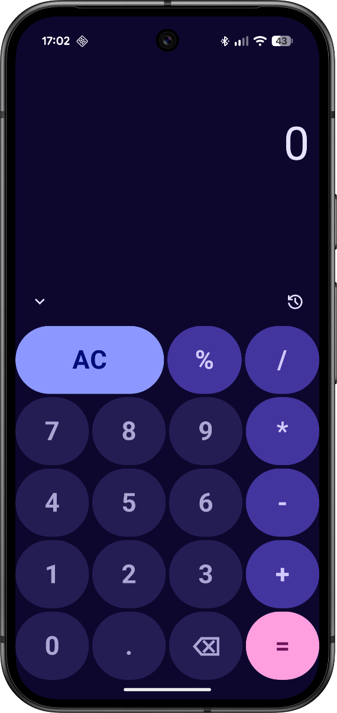
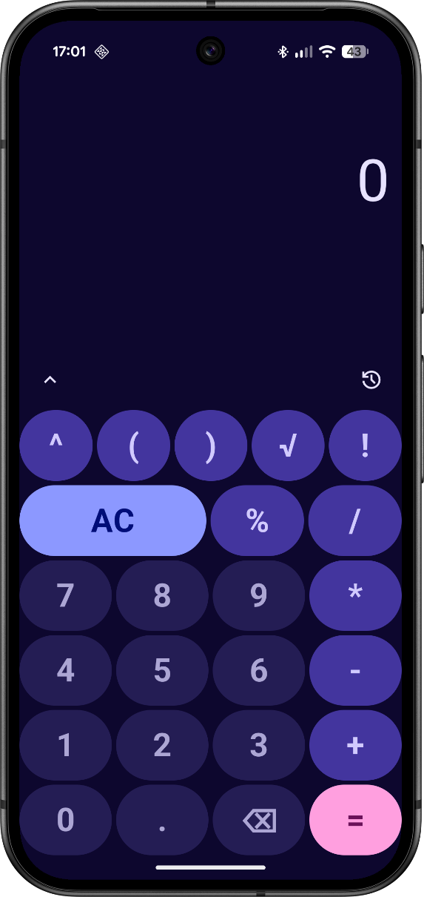
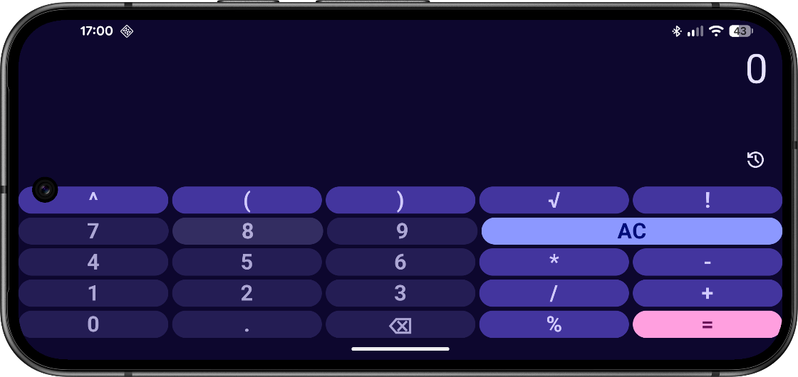

# Calculator App

Simple Android calculator with two modes:
- **Basic** mode for everyday operations
- **Engineering** mode for advanced calculations

The app is adaptive: in portrait mode you can switch modes, and in landscape mode the full flavor focuses on engineering controls.

## Technologies

- Kotlin
- Jetpack Compose (UI)
- Material 3
- ViewModel
- Gradle Kotlin DSL with Version Catalog
- Product flavors: `demo` and `full`

## Screenshots

Basic mode (portrait)

  

Engineering mode (portrait)

  

Engineering mode (landscape)

  

